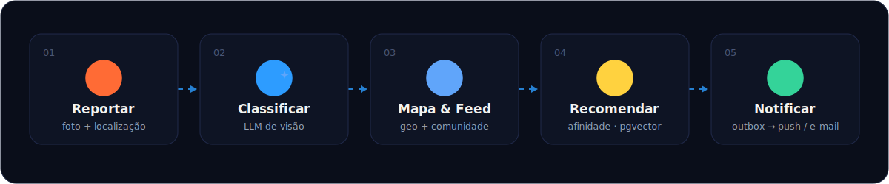

<div align="center">



<br>

**Transparência política municipal:** mapeie problemas de infraestrutura, acompanhe a resolução
e descubra candidatos por afinidade de pautas — tudo em um só lugar.

<br>


&nbsp;


</div>

---

## Por que o Pauta existe

> Em ano eleitoral, fica evidente a **distância entre a população e a política municipal**.

A motivação do projeto nasce de quatro lacunas que se repetem em qualquer cidade:

| | |
|---|---|
| **Desconhecimento político local** | Muitos cidadãos não sabem quem são seus vereadores, suas atuações ou responsabilidades. |
| **Reclamações sem encaminhamento** | Problemas urbanos viram desabafo, mas raramente chegam a quem pode resolver. |
| **Falta de acompanhamento** | Quando se reclama, não há como saber se algo está sendo feito — nem por quem. |
| **Vínculo perdido** | Não existe um canal contínuo entre quem vive o problema e quem representa. |

## A proposta

O **Pauta** aproxima **cidadãos, acontecimentos urbanos e representantes políticos** em uma
única plataforma. O cidadão registra uma demanda local (com foto e localização), acompanha a
resolução, recebe atualizações relevantes e descobre políticos ou candidatos **alinhados aos
seus próprios interesses**.

> **Resultado:** participação política mais simples, informada e contínua.

---

## Como funciona

<div align="center">



</div>

1. **Reportar** — o cidadão envia uma foto + localização do problema.
2. **Classificar** — uma LLM de visão sugere a categoria automaticamente.
3. **Mapa & Feed** — a demanda vira ponto geolocalizado no mapa e publicação na comunidade.
4. **Recomendar** — com base nas pautas de interesse, o sistema sugere políticos por afinidade.
5. **Notificar** — eventos relevantes (proximidade, atualização de status) viram notificações.

---

## Funcionalidades

<table>
<tr>
<td width="50%" valign="top">

### Reportar & Mapa
Problemas geolocalizados com **PostGIS**. Fluxo completo: foto → categoria → ponto no mapa →
acompanhamento de status.

</td>
<td width="50%" valign="top">

### Feed da comunidade
Publicações da vizinhança com **foto opcional** e preview, conectando quem vive o mesmo bairro.

</td>
</tr>
<tr>
<td width="50%" valign="top">

### Recomendação de candidatos
Afinidade por **embeddings + similaridade de cosseno** sobre `pgvector` — políticos alinhados às
suas pautas.

</td>
<td width="50%" valign="top">

### Notificações
Central interna + **push/e-mail** via Celery, alimentada por uma tabela de _outbox_ de eventos.

</td>
</tr>
<tr>
<td width="50%" valign="top">

### Classificação de fotos
LLM de visão (**Cloudflare Workers AI**) categoriza a denúncia, com _fallback_ seguro de revisão
manual.

</td>
<td width="50%" valign="top">

### Autenticação
**Supabase Auth (JWT)** — o backend valida o token; o front usa a sessão do SDK.

</td>
</tr>
</table>

---

## Arquitetura

```
pauta/
├── server/    FastAPI · SQLAlchemy/GeoAlchemy2 · pgvector · Celery · Alembic
├── client/    Next.js 16 (App Router) · Supabase · react-leaflet · Tailwind v4
├── db/         Postgres com PostGIS + pgvector (dev local, via Docker)
└── docker-compose.yml
```

Este repositório é a **espinha dorsal** do projeto — backend, banco e front base — onde os
módulos de IA do time (LLM de fotos, recomendação, notificações) se conectam.

**Decisões de stack**

- **Banco único** — Postgres com **PostGIS** (geometria dos problemas) + **pgvector** (embeddings
  dos políticos). Em produção, o Postgres gerenciado do **Supabase**.
- **Auth** — Supabase Auth (JWT), validada no backend.
- **Storage de fotos** — Supabase Storage, com _fallback_ local em dev.
- **Notificações** — o backend **produz eventos** em `eventos_outbox`; um worker Celery consome,
  cria notificações internas e, quando configurado, dispara push/e-mail.

---

## Como rodar

### Caminho rápido (recomendado)

```bash
make doctor      # valida pré-requisitos (Docker, uv, Node >= 20)
make setup       # cria .envs, instala deps do server e client
# revise server/.env e client/.env.local
make dev         # sobe banco + migrations + server (:8000) + client (:3000)
```

`make setup` já chama `doctor` automaticamente. Veja **`make help`** para todos os targets.

| Target | O que faz |
|---|---|
| `make db-up` / `db-down` / `db-reset` | Banco local (Docker) |
| `make server-dev` / `server-test` / `server-migrate` | Backend |
| `make server-worker` | Worker Celery + beat das notificações |
| `make client-dev` / `client-build` / `client-lint` | Frontend |
| `make check-all` / `make ci` | Lint + typecheck (+ testes/build no `ci`) |
| `make dev-stop` / `make clean` | Mata processos órfãos em :8000/:3000 · limpa caches |

### Passo a passo manual (alternativa)

<details>
<summary><b>1. Banco (Docker)</b></summary>

```bash
docker compose up -d --build   # Postgres + PostGIS + pgvector na porta 5432 (+ Redis p/ Celery)
```
</details>

<details>
<summary><b>2. Backend (FastAPI)</b></summary>

```bash
cd server
cp .env.example .env                  # ajuste SUPABASE_* e CLOUDFLARE_* para serviços reais
uv sync
uv run alembic upgrade head           # cria extensões + tabelas
uv run uvicorn app.main:app --reload --port 8000
```

Docs interativas (Swagger): **http://localhost:8000/docs**

Worker de notificações:

```bash
uv run celery -A app.workers.celery_app worker --beat --loglevel=info
```

Para push real, defina `FIREBASE_CREDENTIALS_PATH`; para e-mail real, `RESEND_API_KEY` e
`EMAIL_FROM`. A central interna funciona sem Resend/FCM.

Testes (precisam do banco no ar):

```bash
uv run pytest
```
</details>

<details>
<summary><b>3. Front (Next.js)</b></summary>

```bash
cd client
cp .env.example .env.local            # preencha NEXT_PUBLIC_SUPABASE_* e a URL da API
npm install
npm run dev                           # http://localhost:3000
```
</details>

<details>
<summary><b>4. Dados de exemplo (opcional)</b></summary>

```bash
cd server
uv run python -m app.cli.seed_politicos ../recommendation/data/df_perfil.csv   # popula a tabela de políticos
```
</details>

---

## Pontos de integração (seams)

Tudo o que é IA mora em `server/app/services/` com **assinatura fixa** — integre por ali sem
tocar em rotas, banco ou contratos:

- **LLM de fotos** — `services/visao.py::classificar(imagem: bytes) -> ClassificacaoFoto`.
  Usa Cloudflare Workers AI (`CLOUDFLARE_ACCOUNT_ID`, `CLOUDFLARE_API_TOKEN`,
  `CLOUDFLARE_AI_MODEL`). Sem credenciais ou em resposta inválida, cai em classificação de
  revisão manual.
- **Recomendação** — `services/recomendacao.py::gerar_embedding(texto) -> list[float]` (stub) e
  `top_politicos_por_similaridade(...)` (query de cosseno pronta). `EMBEDDING_DIM` (`.env`, default
  768) **deve bater** com o modelo do pipeline offline que popula `politicos.embedding`.
- **Notificações** — `routers/notificacoes.py` e `services/eventos.py`. O contrato interno é o
  _outbox_: `tipo`, `payload`, `prioridade`, `processado_em IS NULL` = pendente. O consumidor
  Celery lê os pendentes, dispara push/e-mail e marca como processados.

---

## Estado do projeto

| Área | Status | Detalhe |
|---|---|---|
| Reportar problema + mapa | **Pronto** | End-to-end (front + back + geo + evento) |
| Feed da comunidade | **Pronto** | Publicações com foto opcional |
| Recomendação de candidatos | **Em andamento** | Contrato + query `pgvector` prontos; aguarda embeddings |
| Notificações | **Pronto** | Outbox + central interna + consumidor Celery (push/e-mail) |
| LLM de fotos | **Pronto** | Integrada ao Cloudflare Workers AI, com _fallback_ local seguro |

**Coordenação pendente**

- **`EMBEDDING_DIM`** precisa ser combinado com a equipe de recomendação.
- **Random Forest** (da doc inicial) foi **descartado** em favor de embeddings + cosseno + k-means.
- **Raios de notificação** por tipo de problema ainda precisam ser validados.

<div align="center">
<br>
<sub>Pauta · participação política mais simples, informada e contínua.</sub>
</div>
